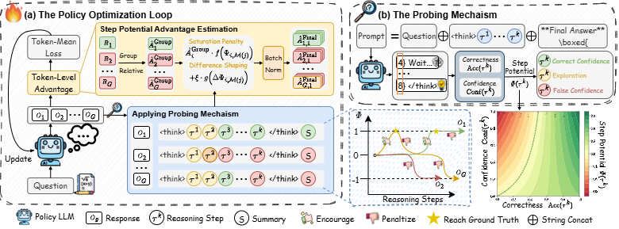
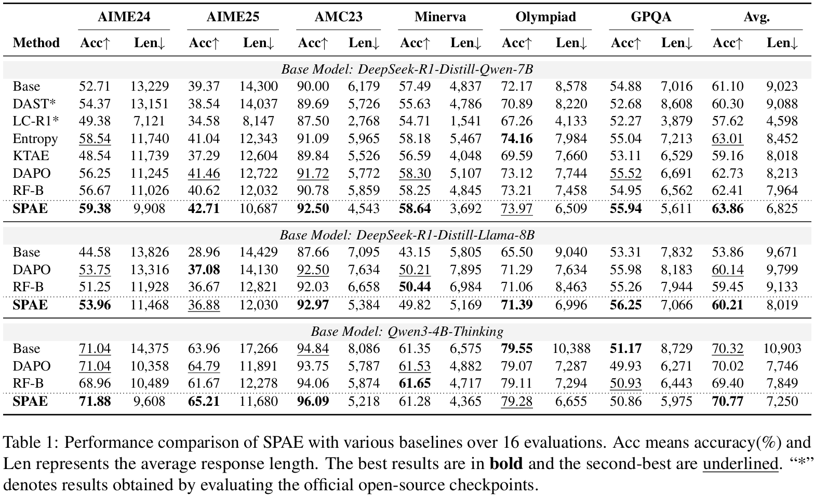
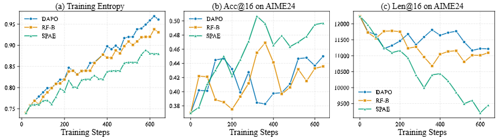
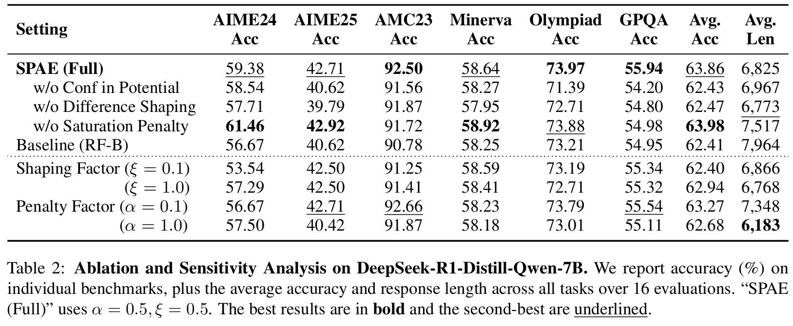
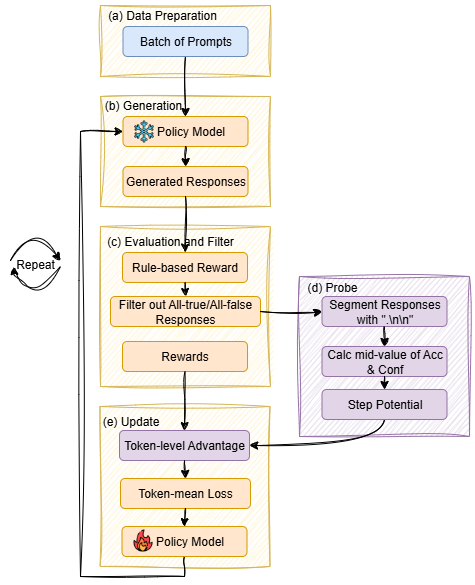

# 🚀Step Potential Advantage Estimation: Harnessing Intermediate Confidence and Correctness for Efficient Mathematical Reasoning🚀

Official implementation of **SPAE (Step Potential Advantage Estimation)** — a step-aware RLVR method that improves credit assignment and suppresses redundant post-solution checking via a training-free probe and Step Potential.

---
## ✨ Overview

RLVR (Reinforcement Learning with Verifiable Rewards) provides only outcome-level supervision, often causing ambiguous credit assignment and **over-thinking**. SPAE introduces:

- **Training-free probing** at step boundaries to estimate intermediate **Correctness** and **Confidence**.
- A bounded scalar **Step Potential** to track step-wise reasoning progress.
- **SPAE advantage** that combines:
  - **Potential Saturation Penalty**: downweights outcome credit after potential saturation to reduce redundant checking.
  - **Potential Difference Shaping**: dense step-wise shaping based on potential increments to highlight pivotal transitions.

The token-level advantage is:
[\
\hat{A}_{i,j}^{\text{SPAE}} =
\hat{A}_i^{\text{Group}} \cdot f(\Phi_{i,\mathcal{M}(j)})
+
\xi \cdot g(\Delta \Phi_{i,\mathcal{M}(j)}).
\]


---
## 🔍 Key Features

- **Training-free**: probing introduces no auxiliary parameters and does not backpropagate through probe generations.
- **Step-aware credit assignment**: aligns semantic progress with optimization.
- **Efficiency gains**: prunes post-solution checking while maintaining or improving accuracy.
- **Diagnostics**: supports solving/checking token decomposition and **Right-to-Wrong** analysis.

---
## 📊 Results

### 1) Comparison With Baseline Methods

### 2) Training Curves of Deepseek-R1-Disitill-Qwen-7B

### 3) Ablation Study


---

## 🧩 Code Example of the Probing Mechanism

This section provides a minimal, open-source–style example of the **training-free probing mechanism** used in SPAE. The script:

1. Queries a **vLLM OpenAI-compatible server** to obtain a long-CoT completion.
    
2. Extracts step boundaries (default delimiter is `"\n\n"` inside the `<think>...</think>` region).
    
3. Inserts a probe prompt after each step: `**Final Answer**\n\boxed{`
    
4. Samples $N$ short continuations and estimates:
    
    - **Confidence** from the entropy of token distributions
        
    - **Correctness** from the log-probability assigned to the ground-truth answer tokens
        
5. Computes **Step Potential** $\Phi$ and potential differences $\Delta\Phi$.

---

### 1) Start a vLLM server (OpenAI-compatible)

Install vLLM and start the server:

```bash
pip install vllm
```

Serve a model:

```bash
vllm serve deepseek-ai/DeepSeek-R1-Distill-Qwen-7B \
  --host 0.0.0.0 \
  --port 8000 \
  --max-model-len 32768 \
  --gpu-memory-utilization 0.9 \
  --api-key your_api_key
```

### 2) Run the example python script

```bash
python inference/probe_mechanism_example.py \
	--model deepseek-ai/DeepSeek-R1-Distill-Qwen-7B \
	--port 8000 \
	--api-key your_api_key \
	--outpath probe_log.txt \
	--question "Solve: If x+3=10, what is x?" \
	--answer "7"
```

--- 
## 🏋️ Training

Our work builds upon and extends the [VeRL](https://github.com/volcengine/verl) framework. We train on [DAPO-MATH-17K]([BytedTsinghua-SIA/DAPO-Math-17k · Datasets at Hugging Face](https://huggingface.co/datasets/BytedTsinghua-SIA/DAPO-Math-17k)).

Our modifications are highlighted in **purple** in the figure below, while **orange** represents the standard VeRL RLVR training pipeline. All SPAE-specific changes are placed under:

* `train/recipe/`

so you can easily inspect, adapt, or port them to other RLVR codebases.



---
## 🌈 Acknowledgement

We would like to thank the following repos for their great work:

- [VeRL](https://github.com/volcengine/verl) for providing the training framework
- [vLLM](https://github.com/vllm-project/vllm) for the efficient inference engine with high throughput
- [transformers](https://github.com/huggingface/transformers) for providing the model-base and fine-tuning framework
---
## 📄 License

This project is released under the Apache 2.0 license. Parts of this project contain code from other sources, which are subject to their respective licenses.
